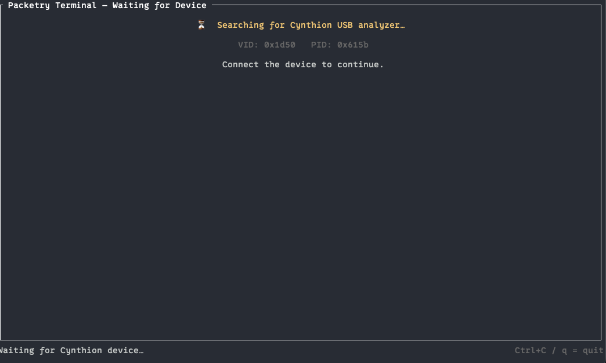
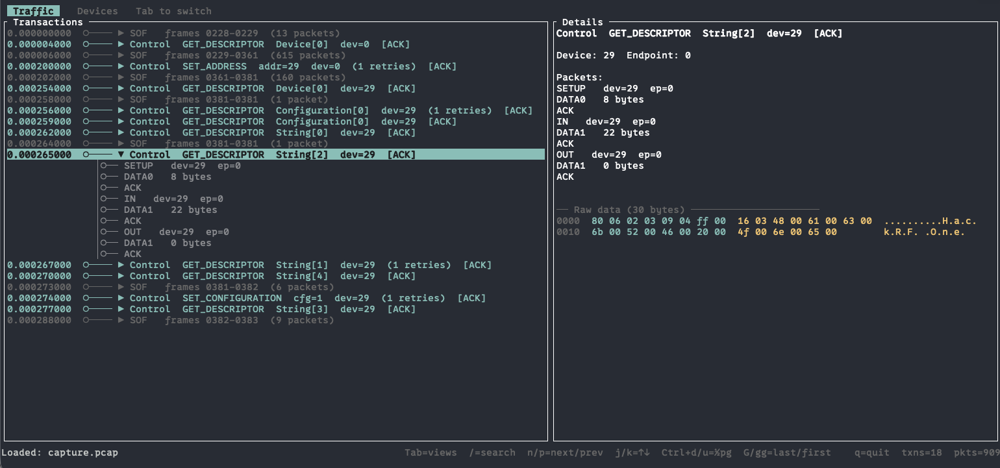
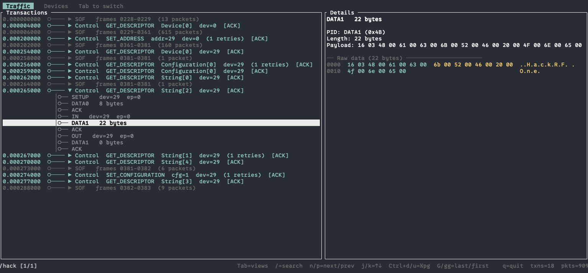
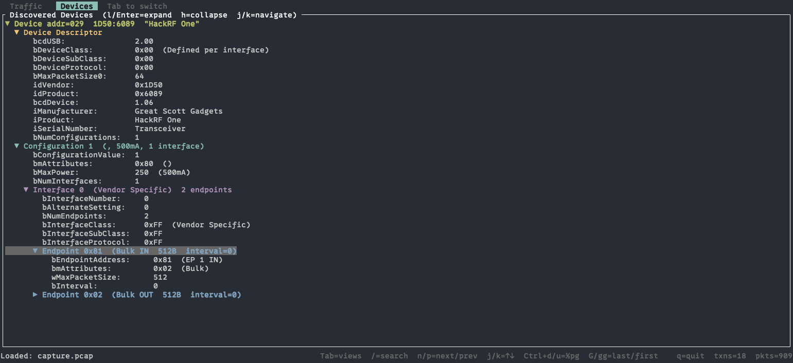
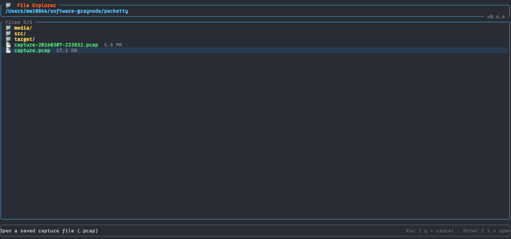

# Packetty

A terminal user interface (TUI) for USB 2.0 protocol analysis using the Cynthion device, built with Rust and ratatui.

## Screenshots

### Waiting for Device


On launch, Packetty scans for a Cynthion USB analyzer (VID `0x1d50`, PID `0x615b`). Once found, it automatically advances to speed selection. Press `o` to open a saved capture file instead.

---

### Traffic View


The main analysis view. The left pane shows a hierarchical transaction tree with nanosecond-precision timestamps. Each top-level node represents a complete USB transfer (Control, Bulk IN/OUT, SOF group, etc.) and can be expanded with `Enter` or `→` to reveal the individual packets. The right pane shows decoded fields for the selected item, plus a colour-coded hex+ASCII dump of the raw payload — here showing a `GET_DESCRIPTOR String[2]` response containing the UTF-16LE product name **"HackRF One"**.

---

### Search


Press `/` to enter vim-style search (only available when reviewing a loaded capture, not during live capture). Type a query and press `Enter` — the status bar shows `/hack [1/1]`. Use `n` / `p` to jump between matches. Search covers transaction labels, decoded fields, raw hex bytes, and UTF-16LE strings, so searching `hack` matches the product name even when stored as `48 00 61 00 63 00 6b 00` in the payload.

---

### Devices View


Press `Tab` to switch to the Devices view. Packetty reconstructs full USB device descriptors by observing `GET_DESCRIPTOR` and `SET_ADDRESS` control transfers. The tree shows device, configuration, interface, and endpoint descriptors — here a **HackRF One** (Great Scott Gadgets, 1D50:6089) with its Vendor Specific bulk endpoint pair. Navigate with `j`/`k`, expand/collapse with `l`/`h` or `Enter`.

---

### Open PCAP File


Press `o` from the waiting screen to open the built-in file browser (`tui-file-explorer`). Navigate the filesystem with arrow keys, filter to `.pcap` files only, and press `Enter` or `l` to load. Press `/` to search for a file by name. Captures can also be loaded directly from the command line with `--load <file.pcap>`.

---

## Features

- **Device Detection**: Automatically detects connected Cynthion devices (VID: 0x1d50, PID: 0x615b)
- **USB Speed Selection**: Choose between High-Speed (480 Mbps), Full-Speed (12 Mbps), Low-Speed (1.5 Mbps), or Auto
- **Hierarchical Packet View**: Display captured USB packets in an expandable tree structure
- **Real-time Capture**: Monitor USB traffic as packets arrive
- **Keyboard Navigation**: Intuitive keyboard controls for all UI elements

## Building

```bash
cargo build --release
```

The binary will be at `target/release/packetty`

## Running

```bash
./target/release/packetty
```

Or with debug symbols:
```bash
cargo run
```

## Usage

### Application States

#### 1. Waiting for Device
- **Display**: Cynthion device search screen
- **What happens**: Application continuously scans for Cynthion device
- **Actions available**:
  - `Ctrl+C` - Exit application

#### 2. Speed Selection
Once device is connected, you'll be prompted to select USB speed:
- **Display**: List of available USB speeds
- **Current options**: High-Speed, Full-Speed, Low-Speed, Auto
- **Actions available**:
  - `↑` / `↓` - Navigate speed options (highlighted in blue)
  - `Enter` - Confirm selection and begin capture
  - `q` - Cancel and return to waiting for device

#### 3. Connecting
Brief intermediate state while establishing device connection
- **Display**: "Connecting..." message
- **What happens**: Opening device interface, configuring USB speed
- **Auto-transitions to**: Capturing (on success) or Error (on failure)

#### 4. Capturing
Active packet capture and display
- **Left pane**: Hierarchical tree of captured packets
  - Shows packets with expandable entries
  - Visual indicators: `▼` (expanded), `▶` (collapsed)
- **Right pane**: Detailed information about selected packet
- **Bottom**: Status bar showing packet count, selected packet, current speed

**Keyboard controls**:
- `↑` / `↓` - Navigate through packets (changes selection)
- `←` / `→` - Collapse/expand selected packet details
- `s` - Change USB speed (returns to Speed Selection)
- `q` - Quit application
- `Ctrl+C` - Force quit

#### 5. Error State
If an error occurs (e.g., device disconnected, communication failure):
- **Display**: Error message explaining the problem
- **Actions available**:
  - `Enter` - Return to waiting for device state

### Example Session

```
$ ./packetty

[Screen shows: "Searching for Cynthion device..."]
(waiting for device...)

[After device connects]
[Screen shows speed selection menu with options:
  • High-Speed (480 Mbps)   <- selected
  • Full-Speed (12 Mbps)
  • Low-Speed (1.5 Mbps)
  • Auto]

Press ↓ to select Full-Speed, then Enter

[Screen shows capture view with packets:
  ┌─ Captured Packets ─────┬─ Packet Details ─────┐
  │ ▼ SETUP 1              │ SETUP 1               │
  │   DATA 1               │ Device=0 EP=0 Recip= │
  │   ACK 1                │ ent=Device Request=   │
  │ ▼ SETUP 2              │ SET_ADDRESS Value=42  │
  │   DATA 2               │ Index=0 Length=0      │
  │   ACK 2                │                       │
  │ ...                    │                       │
  └────────────────────────┴──────────────────────┘
  Packets: 6 | Selected: 1 | Speed: High-Speed
]
```

## Architecture

### Modules

- **main.rs**: Application entry point and event loop
  - Terminal setup and cleanup
  - Main event handling loop
  - Async update coordination

- **app.rs**: Core application state machine
  - AppState enum (WaitingForDevice, SpeedSelection, Connecting, Capturing, Error)
  - Input handling (keyboard events)
  - Async updates from device

- **ui.rs**: Ratatui-based terminal UI
  - Screen rendering for each state
  - Layout management
  - Styling and colors

- **backend.rs**: Cynthion device communication
  - CynthionManager for device lifecycle
  - Device detection via nusb
  - Interface claiming and management
  - Packet simulation for demo

- **models.rs**: Data structures
  - TreeItem: Hierarchical packet representation
  - PacketInfo: Packet metadata
  - PacketTree: Tree data structure
  - PacketDirection: In/Out indicator

### Key Components

**CynthionManager**:
- Searches for Cynthion device (VID: 0x1d50, PID: 0x615b)
- Opens device interface (CLASS: 0xFF, SUBCLASS: 0x10, PROTOCOL: 0x01)
- Manages device state and connection

**App State Machine**:
- Handles all state transitions
- Processes keyboard input
- Manages async device operations
- Maintains packet history buffer (max 1000 packets)

**UI Rendering**:
- Responsive layout that adapts to terminal size
- Color-coded display for visual clarity
- Status bar with real-time statistics

## TODO / Future Improvements
- [ ] Packet filtering by endpoint, direction, type
- [ ] Add unit tests
- [ ] More complex search/find functionality  
- [ ] Statistics and metrics display
- [ ] Configuration file support
- [ ] Horizontal scrolling for long packet details

## Development Notes

### Running Tests

Currently no automated tests. To manually test:

1. **Without device**: Run application and observe device search state
2. **With device**: Application should detect device and proceed through states
3. **UI navigation**: Test all keyboard shortcuts in each state

## License

BSD-3-Clause (same as packetry project)

## Related Projects
Packetty is based on the original work from GreatScottGadgets 

- **packetry** (GTK version): https://github.com/greatscottgadgets/packetry
- **Cynthion device**: https://github.com/greatscottgadgets/cynthion
