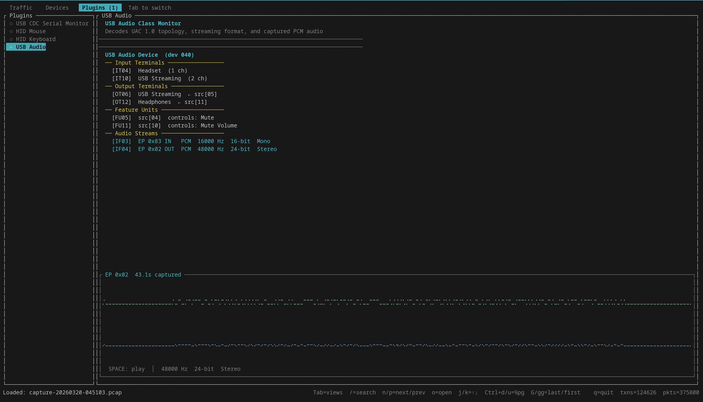

# Packetty

A terminal user interface (TUI) for USB 2.0 protocol analysis using the Cynthion device, built with Rust and ratatui.

## Screenshots

### Waiting for Device


On launch, Packetty scans for a Cynthion USB analyzer (VID `0x1d50`, PID `0x615b`). Once found, it automatically advances to speed selection. Press `o` to open a saved capture file instead.

---

### Traffic View


The main analysis view. The left pane shows a hierarchical transaction tree with nanosecond-precision timestamps. Each top-level node represents a complete USB transfer (Control, Bulk IN/OUT, SOF group, etc.) and can be expanded with `Enter` or `→` to reveal the individual packets. The right pane shows decoded fields for the selected item, plus a colour-coded hex+ASCII dump of the raw payload — here showing a `GET_DESCRIPTOR String[2]` response containing the UTF-16LE product name **"HackRF One"**.

---

### Search


Press `/` to enter vim-style search (only available when reviewing a loaded capture, not during live capture). Type a query and press `Enter` — the status bar shows `/hack [1/1]`. Use `n` / `p` to jump between matches. Search covers transaction labels, decoded fields, raw hex bytes, and UTF-16LE strings, so searching `hack` matches the product name even when stored as `48 00 61 00 63 00 6b 00` in the payload.

---

### Devices View


Press `Tab` to switch to the Devices view. Packetty reconstructs full USB device descriptors by observing `GET_DESCRIPTOR` and `SET_ADDRESS` control transfers. The tree shows device, configuration, interface, and endpoint descriptors — here a **HackRF One** (Great Scott Gadgets, 1D50:6089) with its Vendor Specific bulk endpoint pair. Navigate with `j`/`k`, expand/collapse with `l`/`h` or `Enter`.

---

### Open PCAP File


Press `o` from the waiting screen or the speed-selection screen to open the built-in file browser (`tui-file-explorer`). Navigate the filesystem with arrow keys, filter to `.pcap` files only, and press `Enter` or `l` to load. Press `/` to search for a file by name. Captures can also be loaded directly from the command line with `--load <file.pcap>`.

---

### Plugins View — USB Audio


Press `Tab` twice to reach the Plugins view. The left column lists all registered plugins; the selected plugin's analysis fills the right pane. The **USB Audio** plugin shown here has decoded a full UAC 1.0 topology from the device's configuration descriptor — input/output terminals, feature units with mute/volume controls, and two audio streaming interfaces — and is displaying 43 seconds of captured isochronous PCM audio as a live scrolling waveform. Use `Space` to play/stop, `[`/`]` to switch between captured streams, and `w` to export the selected stream to a `.wav` file.

---

## Features

- **Device Detection**: Automatically detects connected Cynthion devices (VID: 0x1d50, PID: 0x615b)
- **USB Speed Selection**: Choose between High-Speed (480 Mbps), Full-Speed (12 Mbps), Low-Speed (1.5 Mbps), or Auto
- **Hierarchical Transaction Tree**: Each node is a complete USB transfer (Control, Bulk IN/OUT, Interrupt, Isochronous, SOF group); expand with `Enter` or `→` to see individual packets with timestamps and CRC validity
- **Real-time Capture**: Monitor USB traffic as packets arrive, with auto-scroll and live PCAP recording (`Ctrl+S`)
- **PCAP Load/Save**: Open saved captures from the waiting screen, speed-selection screen, or while capturing; export at any time with `Ctrl+S`
- **Vim-style Search**: Press `/` while reviewing a loaded capture to search across labels, decoded fields, hex bytes, and UTF-16LE strings
- **Device Descriptor Reconstruction**: Automatically parses `GET_DESCRIPTOR` responses into a browsable device→configuration→interface→endpoint tree
- **VBUS Control**: Toggle bus power on the TARGET-C port with `v` during live capture
- **Keyboard Navigation**: Full vim-style navigation (`j`/`k`, `g`/`G`, `Ctrl+d`/`u`) across all views
- **Context-sensitive Help**: Press `?` in any state to see available key bindings

### Plugins

Plugins observe every transaction in real time and present protocol-specific analysis in the Plugins tab. Four plugins ship by default:

| Plugin | Class | What it shows |
|---|---|---|
| **CDC Serial Monitor** | 0x02 CDC-Data | Live serial data stream decoded from bulk IN/OUT transfers on CDC-Data interfaces |
| **HID Mouse** | 0x03 HID | Decoded button state and X/Y/wheel deltas from interrupt IN reports |
| **HID Keyboard** | 0x03 HID | Decoded modifier keys and keycodes from interrupt IN reports, with a scrolling key-event log |
| **USB Audio** | 0x01 Audio | Full UAC 1.0 topology (input/output terminals, feature/mixer/selector units), streaming format (sample rate, bit depth, channel count), live braille waveform of captured PCM audio, and playback via the system audio device |

The USB Audio plugin requires the `audio-playback` feature flag for actual playback (`cargo build --features audio-playback`). WAV export works without it.

## Building

```bash
cargo build --release
```

The binary will be at `target/release/packetty`

## Running

```bash
./target/release/packetty
```

Or with debug symbols:
```bash
cargo run
```

## Usage

### Application States

#### 1. Waiting for Device
- **Display**: Cynthion device search screen
- **What happens**: Application continuously scans for Cynthion device
- **Actions available**:
  - `Ctrl+C` - Exit application

#### 2. Speed Selection
Once a device is connected, you'll be prompted to select USB speed:
- **Display**: List of available USB speeds
- **Current options**: High-Speed, Full-Speed, Low-Speed, Auto
- **Actions available**:
  - `↑` / `↓` - Navigate speed options
  - `Enter` - Confirm selection and begin capture
  - `o` - Open a pcap file without starting a capture
  - `Esc` / `q` - Return to waiting for device

#### 3. Connecting
Brief intermediate state while establishing device connection
- **Display**: "Connecting..." message
- **What happens**: Opening device interface, configuring USB speed
- **Auto-transitions to**: Capturing (on success) or Error (on failure)

#### 4. Capturing
Active packet capture and display
- **Left pane**: Hierarchical tree of captured packets
  - Shows packets with expandable entries
  - Visual indicators: `▼` (expanded), `▶` (collapsed)
- **Right pane**: Detailed information about selected packet
- **Bottom**: Status bar showing packet count, selected packet, current speed

**Keyboard controls**:
- `↑`/`↓` / `j`/`k` - Navigate transactions
- `→`/`l` / `←`/`h` - Expand / collapse; `Enter` toggles
- `Tab` - Cycle views (Traffic → Devices → Plugins)
- `s` - Return to speed selection (live capture only)
- `v` - Toggle VBUS on TARGET-C (live capture only)
- `o` - Open a different pcap file
- `Ctrl+S` - Start / stop PCAP recording (live capture only)
- `/` - Search (loaded file only); `n`/`p` next/previous match
- `?` - Toggle help popup
- `q` / `Esc` - Quit

#### 5. Error State
If an error occurs (e.g., device disconnected, communication failure):
- **Display**: Error message explaining the problem
- **Actions available**:
  - `Enter` - Return to waiting for device state

### Example Session

```
$ ./packetty

[Screen shows: "Searching for Cynthion device..."]
(waiting for device...)

[After device connects]
[Screen shows speed selection menu with options:
  • High-Speed (480 Mbps)   <- selected
  • Full-Speed (12 Mbps)
  • Low-Speed (1.5 Mbps)
  • Auto]

Press ↓ to select Full-Speed, then Enter

[Screen shows capture view with packets:
  ┌─ Captured Packets ─────┬─ Packet Details ─────┐
  │ ▼ SETUP 1              │ SETUP 1               │
  │   DATA 1               │ Device=0 EP=0 Recip= │
  │   ACK 1                │ ent=Device Request=   │
  │ ▼ SETUP 2              │ SET_ADDRESS Value=42  │
  │   DATA 2               │ Index=0 Length=0      │
  │   ACK 2                │                       │
  │ ...                    │                       │
  └────────────────────────┴──────────────────────┘
  Packets: 6 | Selected: 1 | Speed: High-Speed
]
```

## Architecture

### Modules

- **main.rs**: Entry point — terminal setup/teardown, async event loop, `--load` CLI flag
- **app.rs**: State machine (`WaitingForDevice` → `SpeedSelection` → `Connecting` → `Capturing`), all input handling, async update dispatch
- **ui.rs**: Ratatui rendering for every state; help popup; device tree; plugin tab strip
- **backend.rs**: `CynthionManager` — device detection via nusb, interface claiming, USB packet framing, transaction assembly (`TransactionBuilder`), PCAP read/write, VBUS control
- **models.rs**: `TransactionInfo`, `TreeItem`, `PacketItem`, `FlatRow`, USB descriptor types, efficient O(n) flat-row helpers
- **pcap.rs**: PCAP global header and record read/write
- **plugins/mod.rs**: `UsbPlugin` trait and `PluginManager`; plugins receive every decoded transaction via `on_transaction` and render into the Plugins tab
- **plugins/cdc.rs**: CDC Serial Monitor plugin
- **plugins/hid\_mouse.rs**: HID Mouse plugin
- **plugins/hid\_keyboard.rs**: HID Keyboard plugin
- **plugins/audio.rs**: USB Audio Class (UAC 1.0) plugin — descriptor parsing, isochronous PCM capture, waveform rendering, playback, WAV export

## Development Notes

### Running Tests

Currently no automated tests. To manually test:

1. **Without device**: Run application and observe device search state
2. **With device**: Application should detect device and proceed through states
3. **UI navigation**: Test all keyboard shortcuts in each state

## License

BSD-3-Clause (same as packetry project)

## Related Projects
Packetty is based on the original work from GreatScottGadgets 

- **packetry** (GTK version): https://github.com/greatscottgadgets/packetry
- **Cynthion device**: https://github.com/greatscottgadgets/cynthion
